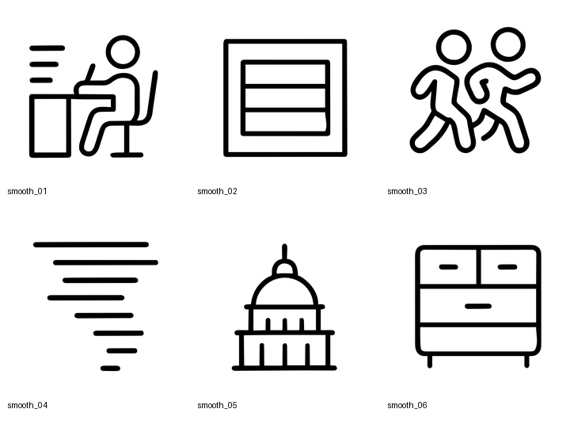
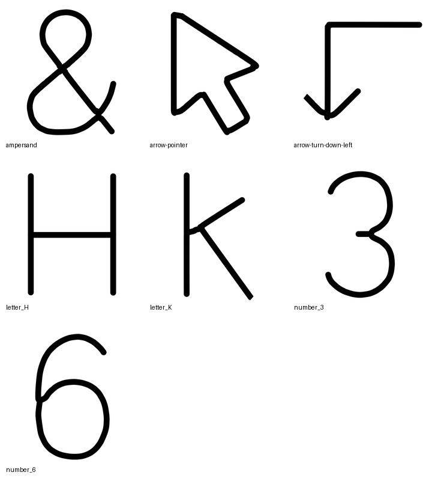
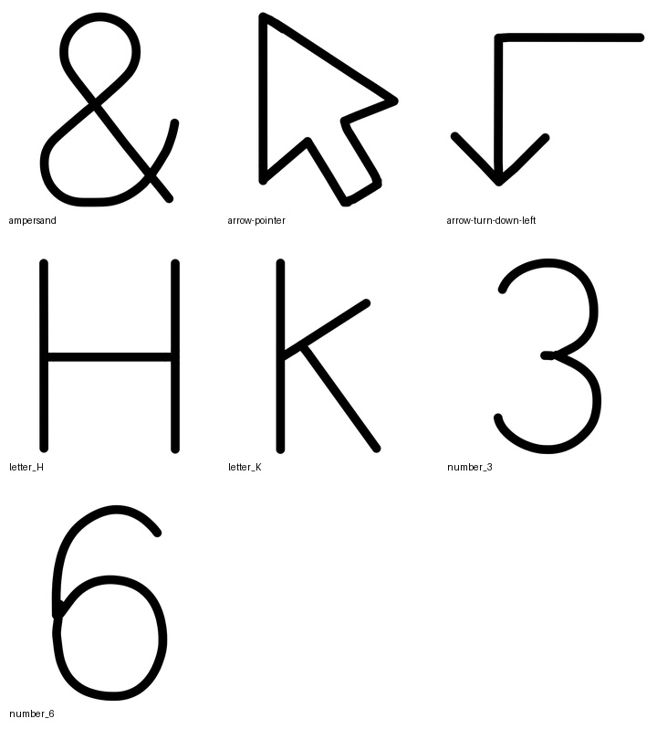

# Raster-to-Vector Research Demo

This repository contains two image-processing experiments around raster-to-vector conversion for black line-art icons.

## What is included

- `outputs/smooth_patched/`: SVG outputs for all 6 Experiment A images, generated by a patched VTracer pipeline.
- `outputs/centerline/`: SVG outputs for Experiment B, generated by a no-third-party-library centerline extractor.
- `centerline/centerline.py`: standalone Python implementation for medial-axis extraction.
- `patches/`: patch files for VTracer and VisionCortex.
- `vendor/`: generated by `scripts/run_all.sh`; not checked in.
- `analysis/`: rendered thumbnails used for visual QA.
- `REPORT.md`: short research-style summary.
- `analysis/report.html`: side-by-side visual review page.
- `analysis/metrics.md`: lightweight quantitative QA metrics.

## Reproduce

From this folder:

```bash
./scripts/run_all.sh
```

The script clones VTracer/VisionCortex if needed, applies the patches, builds the patched VTracer binary, regenerates Experiment A SVGs, and then regenerates the centerline SVGs.

Optional QA/report assets:

```bash
python3 scripts/generate_review_assets.py
```

`centerline/centerline.py` uses only the Python standard library. The optional QA script uses Pillow and macOS Quick Look thumbnails for local visual review.

## Experiment A: Smooth PNG to SVG

I used VTracer as the base vectorizer and patched its core `visioncortex` dependency instead of only tuning command-line parameters.

Core modifications:

- `vendor/vtracer/Cargo.toml`: patches the `visioncortex` crate to the local editable copy.
- `vendor/visioncortex/src/path/smooth.rs`: clamps cubic Bezier handles relative to chord length after fitting. This reduces handle overshoot near sharp icon corners and prevents small raster defects from becoming exaggerated loops.
- `vendor/visioncortex/src/path/paths.rs`: fixes `PathF64::smooth` so iterative subdivision uses the updated path from the previous iteration instead of repeatedly subdividing the original path.

Example command for one image:

```bash
vendor/vtracer/target/release/vtracer \
  --input samples/smooth_png/smooth_01.png \
  --output outputs/smooth_patched/smooth_01.svg \
  --colormode bw \
  --mode spline \
  --filter_speckle 4 \
  --corner_threshold 60 \
  --segment_length 4 \
  --splice_threshold 45 \
  --path_precision 3
```

The full batch is generated by `scripts/run_all.sh`, which processes every PNG in `samples/smooth_png/`.

Visual QA:



## Experiment B: Centerline Extraction

`centerline/centerline.py` uses only Python standard library modules. No PIL, OpenCV, NumPy, scikit-image, or SVG libraries are used in the extraction code.

Pipeline:

1. Decode PNG directly: parse chunks, zlib-decompress IDAT, and reverse PNG filters.
2. Convert to a binary mask with Otsu thresholding plus an anti-aliasing bias for black-on-white strokes.
3. Apply Zhang-Suen thinning to obtain a topology-preserving skeleton.
4. Compute a chamfer distance transform for stroke-radius estimation and short-spur pruning.
5. Collapse skeleton junction clusters into graph nodes using crossing-number and directional-arm detection.
6. Trace graph edges into ordered polylines, including closed cycles.
7. Smooth locally, simplify with Ramer-Douglas-Peucker, then emit a hybrid SVG: straight graph edges become `L` commands, curved edges become cubic paths.

Command used:

```bash
python3 centerline/centerline.py \
  samples/centerline/input \
  outputs/centerline \
  --stroke-width 45 \
  --precision 2 \
  --simplify-epsilon 2.2 \
  --smooth-rounds 2 \
  --line-epsilon 2.8
```

Visual QA against the provided reference:





## Notes on Tradeoffs

- The centerline solution is intentionally transparent and explainable rather than library-driven. The code is slower than OpenCV/scikit-image, but it exposes every step of the medial-axis approximation.
- The largest remaining weakness is junction aesthetics: overlapping round caps can create slightly heavier joins. I kept this because the topology is correct and the visual result matches the provided references closely.
- For Experiment A, I tested a more aggressive straight-edge regularizer, but rejected it because it over-regularized small rectangular icons and bent geometry. The final patch keeps the safer Bezier-handle and iteration fixes.

## References

- VTracer: https://github.com/visioncortex/vtracer
- VisionCortex core library: https://github.com/visioncortex/visioncortex
- Potrace paper by Peter Selinger: https://potrace.sourceforge.net/potrace.pdf
- Zhang and Suen, "A fast parallel algorithm for thinning digital patterns", DOI 10.1145/357994.358023
